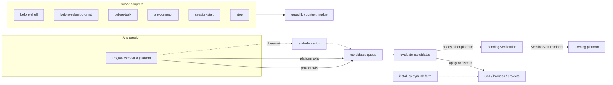

# Cross-agent shared rules and tools

Single source of truth for the configuration shared by every coding agent on
this host: Claude Code, Cursor, Google Antigravity, and — documented but not
installed here yet — OpenAI Codex and GitHub Copilot CLI. Each agent's own
native config is either a symlink into this repo, a thin wrapper importing it,
or a generated file. **Edit content only in this directory, never in a
per-agent copy.**

All paths below were checked against each platform's current documentation and
against what actually exists on disk here, in July 2026. `scripts/install.py`
prints the farm's real state, which is the only way to check it that does not
lie: a plain glob over `~/.gemini/config/` reports nothing, because every entry
there is a symlink and globbing does not traverse them. Run the script rather
than trusting either this file or a directory listing.

## Design principles

1. **Foundation** — this directory is the SoT for host rules, skills, agents,
   workflows, shared hook policy (`guardlib`), and the candidates queue.
2. **Platforms × projects are crossed** — not a stack. Any platform can work
   on any project. Knowledge surfaces on either axis independently into
   `candidates/open/{project,platform}/` (write only when there is something
   to file). See `candidates/README.md`.
3. **Platform write-ownership** — edit shared SoT freely from any platform.
   Live platform configs and “this works on X” claims belong to platform X;
   cross-writes become `needs_verification` under
   `candidates/pending-verification/`.
4. **Close-out / evaluate** — `skills/end-of-session` (commit on invoke, ask
   before push; conditional handoff) and `skills/evaluate-candidates`
   (async apply/discard from a coding-agent-config session). Progressive
   context nudges (Cursor: `beforeSubmitPrompt` / `stop` / `preCompact`)
   suggest handoff earlier than auto-compact; they never force mid-task
   handoff.

<!-- arch:flows:start -->

<!-- arch:flows:end -->

## The one rule that shapes everything else

`AGENTS.md` is the industry-standard filename and nearly every agent reads it.
**Claude Code does not.** Its own documentation states it plainly: Claude Code
reads `CLAUDE.md`, with no AGENTS.md fallback, and the officially recommended
fix is a `CLAUDE.md` whose first line is `@AGENTS.md`. Everything below follows
from that single asymmetry:

| Agent | Project prose | User-level prose |
|---|---|---|
| Cursor | `AGENTS.md` (root and nested, always on), also reads `CLAUDE.md` | none on disk — `~/.cursor/rules/` is **not** supported |
| Claude Code | `CLAUDE.md` only, with `@` imports up to 4 hops | `~/.claude/CLAUDE.md` |
| Antigravity | `AGENTS.md` **and** `GEMINI.md` (GEMINI.md wins conflicts) since v1.20.3 | `~/.gemini/AGENTS.md`, `~/.gemini/GEMINI.md` |
| Copilot cloud agent, code review | `AGENTS.md`, `CLAUDE.md`, `GEMINI.md` | none — runs on GitHub's machines |
| Copilot Chat (IDE, github.com) | `.github/copilot-instructions.md` only | personal instructions, in the UI |
| Codex | `~/.codex/AGENTS.md` plus every `AGENTS.md` from git root down to cwd, 32 KiB cap | `~/.codex/AGENTS.md` |

## Layout

<!-- arch:tree:start -->
```mermaid
flowchart TB
  subgraph skills[skills/]
    sk_end_of_session[end-of-session]
    sk_evaluate_candidates[evaluate-candidates]
    sk_handoff[handoff]
    sk_results_report[results-report]
    sk_reviewer_response[reviewer-response]
    sk_test_design[test-design]
    sk_update_paper[update-paper]
  end
  subgraph agents[agents/]
    ag_gpu_job_runner[gpu-job-runner]
    ag_paper_editor[paper-editor]
  end
  subgraph workflows[workflows/]
    wf_repo_hygiene[repo-hygiene]
  end
  subgraph harness[harness/]
    ha_antigravity[antigravity]
    ha_claude[claude]
    ha_cursor[cursor]
  end
  subgraph scripts[scripts/ (top-level)]
    sc_antigravity[antigravity]
    sc_candidate_reminders_py[candidate-reminders.py]
    sc_claude[claude]
    sc_context_nudge_py[context_nudge.py]
    sc_guard_long_run_py[guard-long-run.py]
    sc_guard_model_family_py[guard-model-family.py]
    sc_guard_rm_py[guard-rm.py]
    sc_guard_wait_loop_py[guard-wait-loop.py]
    sc_install_py[install.py]
    sc_lint_plan_waves_py[lint_plan_waves.py]
    sc_migrate_to_agents_md_py[migrate_to_agents_md.py]
    sc_paper_sync_reminder_py[paper-sync-reminder.py]
    sc_render_architecture_py[render_architecture.py]
    sc_session_status_py[session-status.py]
    sc_sync_agent_rules_py[sync_agent_rules.py]
    sc_test_sync_agent_rules_py[test_sync_agent_rules.py]
    sc_vendor_sync_agent_rules_sh[vendor-sync-agent-rules.sh]
    sc_verify_tiering_py[verify_tiering.py]
  end
  subgraph candidates[candidates/]
    ca_open_project[open/project]
    ca_open_platform[open/platform]
    ca_done[done]
    ca_pending_verification[pending-verification]
  end
```
<!-- arch:tree:end -->

- `AGENTS.md` — host-wide prose rules, strictly tool-agnostic, and the register
  of things that have gone wrong more than once. Reached by `@`-import from
  `~/.claude/CLAUDE.md` and `~/.gemini/GEMINI.md`, by symlink from
  `~/AGENTS.md` and `~/.gemini/AGENTS.md`, and by inlining into each project's
  own `AGENTS.md` (see below). **An edit here is live everywhere at once with
  no sync step**, except for the inlined copies, which a script maintains.
- `harness/<agent>.md` — the mechanics that only make sense for one agent: its
  tool names, its way of backgrounding a job, where it keeps its own config.
  This split is what stops `~/.claude/CLAUDE.md`'s "use `Monitor` and
  `run_in_background`" advice from being handed to Cursor, where neither tool
  exists.
- `skills/<name>/SKILL.md` and `agents/<name>.agent.md` — canonical **global**
  tools, real files (skills and subagents have no import syntax, so the content
  itself must exist at whatever path each platform scans). Distributed by the
  symlink farm. Use these only for genuinely generic tools — no project name,
  no project-specific path or metric baked in. Agent SoT files use the
  `.agent.md` extension; platform links rename as needed (`<n>.md` for Claude
  and Cursor, `<n>.agent.md` for Copilot). Keep SoT bodies tool-agnostic —
  Claude-oriented `tools:` frontmatter is ignored or remapped by Cursor.
- `workflows/<name>.md` — host-wide slash prompts (plain markdown, filename =
  `/name`). Linked into Cursor's `~/.cursor/commands/` and Antigravity's
  `~/.gemini/config/global_workflows/`. Claude does **not** get these: its
  slash surface is skills. Promote a workflow to a skill if Claude must also
  auto-trigger it.
- `candidates/` — crossed-axis knowledge queue (`open/project`, `open/platform`,
  `done/`, `pending-verification/`). Schema in `candidates/README.md`.
- `enforceable-rules.md` — register of must-rules → mechanisms (soft plan-wave
  linter first; see `scripts/lint_plan_waves.py`).
- `projects.json` — host index of project roots for cross-project lifts during
  `evaluate-candidates`.
- `mcp/catalog.json` — intentionally shared MCP servers. `install.py` upserts
  each named server into Cursor, Antigravity and Claude configs without
  removing unrelated entries. Secrets stay in `${env:NAME}` placeholders.
- `scripts/guardlib/` — hook policy: pure functions that return a verdict.
  Shell policies take a command (`wait_loop`, `destructive_rm`, `long_run`);
  `model_family` takes a requested model slug + platform. No stdin, no stdout,
  no knowledge of any agent.
- `scripts/guard-*.py`, `scripts/cursor/before-shell.py`,
  `scripts/cursor/before-task.py`, `scripts/antigravity/` — thin per-agent
  adapters over `guardlib`, one per hook dialect.
- `scripts/install.py` — creates and verifies the symlink farm, and upserts
  the MCP catalog.
- `scripts/sync_agent_rules.py` — maintains each project's generated rule
  files. Vendored, not referenced centrally (see below).

### The skeleton + thin-wrapper pattern

A handful of skills (`test-design`, `update-paper`, `reviewer-response`,
`results-report`) exist independently in more than one project with the same
shape but genuinely different bodies — different paper repo hashes, different
metric names. For these, the file here holds the generic procedure and each
project keeps its own `.claude/skills/<name>/SKILL.md` shrunk to its own
`description` frontmatter (which must stay project-specific, since it is what
triggers invocation) plus one line pointing at this copy, plus its own
specifics. **This is not a guaranteed system-level import** the way an `@`
import is — it relies on the agent complying with an instruction. Test a new
one for real before trusting it with anything that matters. Same for the
`paper-editor` and `gpu-job-runner` agent skeletons.

## How host rules reach each agent

Three different mechanisms, because no single one reaches everything:

1. **Import** — `~/.claude/CLAUDE.md` and `~/.gemini/GEMINI.md` are two-line
   files that `@`-import `AGENTS.md` and `harness/<agent>.md`. Zero drift.
2. **Symlink** — `~/AGENTS.md` (for a Cursor session opened on the home
   directory), `~/.gemini/AGENTS.md`, and `~/.codex/AGENTS.md` once Codex
   exists here. Also zero drift; the same bytes.
3. **Inlining** — the `host-rules` block that `sync_agent_rules.py` maintains
   at the end of every project's `AGENTS.md`.

The third exists because of one hard constraint: **Copilot's cloud agent and
Cursor's cloud agents run on machines that have never seen this home
directory.** Anything they must obey has to be committed inside the project's
own repo. That inlining is also why Claude sees the host rules twice — once
from `~/.claude/CLAUDE.md`, once inside the project's `AGENTS.md`. The
duplication is deliberate, not drift.

Cursor is the awkward case for harness rules specifically: it has no
user-level rules file at all. `~/.cursor/rules/*.mdc` is not read (confirmed
against Cursor's docs and its own forum), and User Rules live only in
Settings → Rules as plain text synced to the account, so they cannot be
version-controlled here. `harness/cursor.md` is therefore delivered per project
as a generated `.cursor/rules/cursor-harness.mdc` with `alwaysApply: true`. If
you want a global belt-and-braces, add this as a User Rule by hand:

    Before anything else in a session outside a project, read
    /home/itec/emanuele/.agent-rules/AGENTS.md and
    /home/itec/emanuele/.agent-rules/harness/cursor.md with the Read tool,
    and follow them for the rest of the session.

## Per-project layout

Since 2026-07-25 the direction is inverted from what it used to be. `AGENTS.md`
is the hand-edited source; `CLAUDE.md` is the wrapper.

| File | Status | Who reads it |
|---|---|---|
| `AGENTS.md` | hand-edited, except its `host-rules` block | Cursor, Antigravity, Codex, Copilot cloud agent and code review |
| `CLAUDE.md` | thin: `@.claude/project-core.md` plus Claude-only notes | Claude Code (and Cursor, which also always applies it) |
| `.claude/project-core.md` | generated: `AGENTS.md` minus the host block, minus every `scope:`-marked section | Claude Code, via the import above |
| `.claude/rules/<slug>.md` | generated: one per `scope:`-marked section, deferred by `paths:` | Claude Code, on demand |
| `.github/instructions/<slug>.instructions.md` | generated: the same sections, deferred by `applyTo:` | Copilot Chat, on demand |
| `.cursor/rules/cursor-harness.mdc` | generated from `harness/cursor.md` | Cursor |
| `.github/copilot-instructions.md` | generated pointer at `AGENTS.md`, plus whatever the project marks `copilot-critical` | Copilot Chat |
| `.agent-guards.json` | hand-edited | every agent's hook adapter |
| `.claude/skills/`, `.claude/agents/` | real directories | Claude, Cursor, Copilot |
| `.agents/skills`, `.agents/agents` | symlinks onto the above | Antigravity, Codex, Cursor, Copilot |
| `.cursor/agents` | symlink onto `.claude/agents` | Cursor native project path |
| `.agents/workflows/` | real directory (project slash prompts) | Antigravity |
| `.cursor/commands` | symlink onto `.agents/workflows` | Cursor |
| `.mcp.json` / `.cursor/mcp.json` / `.agents/mcp_config.json` | only if the project needs its own MCP servers | Claude / Cursor / Antigravity |

Deleted by the migration, and removed automatically by `sync_agent_rules.py`
if it finds them: `.agents/rules/<project>.md` (Antigravity reads the root
`AGENTS.md` natively now) and `tools/host_rules_snapshot.md` (see below).
`.github/instructions/` used to be on that list; since 2026-07-28 it is back
with a different job — see below — and is no longer swept.

### Tiered delivery: `scope:` markers (2026-07-28)

`AGENTS.md` files had grown to 220–520 lines, all of it loaded in every Claude
session on top of the host rules, and the last 164 lines of every one of them
were the `host-rules` block Claude had *already* loaded from
`~/.claude/CLAUDE.md`. Claude Code's own guidance is under 200 lines per file,
on the grounds that longer files measurably reduce adherence.

The apparent conflict — one file for every agent, versus a short file — is
resolved by separating **source** from **delivery**. `AGENTS.md` stays the
single hand-edited source and stays complete. What changes is that the
platforms which *can* defer part of it now do:

| | Always-on | Deferred |
|---|---|---|
| Claude Code | `CLAUDE.md` → `@.claude/project-core.md` | `.claude/rules/*.md` with `paths:` |
| Copilot Chat | `.github/copilot-instructions.md` | `.github/instructions/*.instructions.md` with `applyTo:` |
| Cursor, Codex, Antigravity, Copilot cloud | the whole `AGENTS.md` | — no mechanism; eager by design |

Mark a section by putting `<!-- scope: src/**, tests/** -->` on its own line
immediately above its `## ` heading. Unmarked sections are always-on for
everyone. The marker is an HTML comment, so it is inert for every agent that
reads `AGENTS.md` raw.

Nothing is removed from `AGENTS.md`, so no agent can lose a rule — the eager
platforms are byte-for-byte unaffected. `scripts/verify_tiering.py` proves
that mechanically: every non-blank line of a project's `AGENTS.md`, outside
the host block, must appear in the core or in exactly one rule file, and never
in both. `scripts/test_sync_agent_rules.py` covers the split itself (an early
version made adjacent scoped sections produce overlapping cut ranges, which
silently ate an unrelated heading out of the core).

Measured effect on Claude's startup context, in lines:

| Project | Before | After | Deferred |
|---|---|---|---|
| pointstream | 806 | 506 | 213 |
| presley | 802 | 432 | 252 |
| moq3dgs | 601 | 385 | 100 |
| TIGAS | 643 | 423 | 98 |
| 4DGStudy | 507 | 340 | 46 |

The host file `AGENTS.md` was trimmed 150 → 121 lines in the same pass, which
shrinks both the home import and all five inlined `host-rules` blocks.

**The cost to be honest about:** a deferred rule is not in context until Claude
reads a matching file. A session that reasons *about* an area without opening
its files — planning an experiment, answering a question about the test
suite — will not have those rules unless it goes and reads them. The generated
core ends with an index of what was deferred and the instruction to read it in
exactly that case, but that is an instruction Claude has to follow, not a
guarantee the way an eager load is. Scope a section only when it genuinely
tracks a set of paths; leave anything that shapes judgment in every session
unmarked.

The project-level skills directory is real under `.claude/` and symlinked from
`.agents/`, rather than the other way round. That is deliberate and worth not
"fixing": Claude Code is the only consumer whose symlink-following behaviour is
explicitly documented, so the one agent with a guarantee gets the real path.

### Exception: `sync_agent_rules.py` is vendored, not referenced centrally

Every other script here is invoked by an absolute path back into this
directory. `sync_agent_rules.py` cannot be: it runs in each project's CI and
pre-commit, and CI runners have no access to `~/.agent-rules/` at all. So it is
hand-edited here and physically copied into each project's `tools/` by
`scripts/vendor-sync-agent-rules.sh`. That script now refuses to copy into a
project whose `CLAUDE.md` does not yet import `AGENTS.md`, because the new
script would rewrite an old-layout project's generated `AGENTS.md` over itself.

`tools/host_rules_snapshot.md` used to exist so CI could still verify the
generated files without reaching `~/.agent-rules/`. It is gone: when the host
file is unreachable, the script now leaves the committed `host-rules` block
exactly as it is, so `--check` compares only what it can legitimately verify.

## Hooks

Hook *policy* is shared; hook *plumbing* cannot be. The platforms disagree on
config location, event names, capitalisation, and — the part that actually
bites — the payload and response contract:

| | Claude Code | Cursor | Antigravity | Codex | Copilot CLI |
|---|---|---|---|---|---|
| Global config | `~/.claude/settings.json` | `~/.cursor/hooks.json` | `~/.gemini/config/hooks.json` | `~/.codex/hooks.json` or `[hooks]` in `config.toml` | `~/.copilot/hooks/*.json` |
| Project config | `.claude/settings.json` | `.cursor/hooks.json` | `.agents/hooks.json` | `.codex/hooks.json` | `.github/hooks/*.json` |
| Shell event | `PreToolUse` + `Bash` matcher | `beforeShellExecution` | `PreToolUse` + `run_command` matcher | `PreToolUse` + regex matcher | `preToolUse` |
| Command in | `tool_input.command` | top-level `command` | payload `command` | `tool_input.command` | assumed Claude-shaped |
| Denial out | `hookSpecificOutput.permissionDecision` | `{"permission": "deny"}` | script exit status | hook JSON verdict | unverified |

So a single script cannot serve them all: pointing Cursor's `hooks.json` at
`guard-wait-loop.py` would produce a hook that runs, succeeds, and silently
never blocks anything. Instead the policy lives once in `scripts/guardlib/`
(`wait_loop`, `destructive_rm`, `long_run`, `model_family`) and each dialect
gets a thin adapter that knows only how to read that platform's payload and
phrase that platform's answer — including naming the right *alternative* in a
denial message, since telling Cursor to use `run_in_background` would be
useless advice.

**Model family:** prefer omit/inherit so subagents stay on each platform's
in-house models (Cursor → Grok/Composer, Claude → Claude, Antigravity →
Gemini). Family-prefix allowlists only — no versioned slug lists (they go
stale). Cursor live wiring: `preToolUse`/`Task` + `subagentStart` →
`scripts/cursor/before-task.py` (`failClosed: true`). Claude
(`guard-model-family.py`) and Antigravity
(`antigravity/guard-model-family.py`) adapters are in SoT but were authored
from a Cursor session — **live wire + deny tests are pending** under
`candidates/pending-verification/{claude,antigravity}.md` (platform
write-ownership). Multi-family plugin defaults (e.g. Cursor marketplace
pstack) are untrusted here.

Per-project values — which directories are unrecoverable, which entry points
are long training runs — live in each project's `.agent-guards.json`, because
Cursor's user-level `hooks.json` is shared across every project and has nowhere
to put per-project arguments. Claude's existing CLI arguments still win when
present, so its wiring keeps working unchanged.

### Fail-open versus fail-closed

Advisory scripts that only ever print (`session-status.py`,
`paper-sync-reminder.py`, `guard-long-run.py`) are made directly executable
(`chmod +x`, no interpreter prefix) so a missing file hits the real "command
not found" fail-open path. `python3 <missing path>` would instead run fine and
exit 2, which on some events — notably Claude's `Stop`, where exit 2 means
"prevents Claude from stopping" — turns a missing advisory script into a hung
session.

Safety guards that can actually deny (`guard-rm.py`, `guard-wait-loop.py`,
`guard-model-family.py`, `cursor/before-task.py`) are
invoked *via* `python3 <path>` for exactly the opposite reason: a missing file
then fails closed and blocks the call, rather than silently letting through the
thing it exists to prevent. Cursor makes this explicit with `failClosed: true`
in `~/.cursor/hooks.json` (verified 2026-07-25 — see below).

## Global tool locations per platform

| | Claude Code | Cursor | Antigravity | Codex | Copilot CLI |
|---|---|---|---|---|---|
| Global skills | `~/.claude/skills/<n>/SKILL.md` | reads `~/.cursor/`, `~/.agents/`, `~/.claude/`, `~/.codex/` skills | `~/.gemini/config/skills/<n>/` | `~/.agents/skills/<n>/` | `~/.copilot/skills/<n>/`, `~/.agents/skills/` |
| Project skills | `.claude/skills/<n>/` | `.cursor/`, `.agents/`, `.claude/`, `.codex/` skills | `.agents/skills/<n>/` | `.agents/skills/<n>/` | `.github/`, `.claude/` or `.agents/skills` |
| Global agents | `~/.claude/agents/<n>.md` | `~/.cursor/agents/<n>.md` (also reads `~/.claude/`) | not verified | not verified | `~/.copilot/agents/<n>.agent.md` |
| Project agents | `.claude/agents/<n>.md` | `.cursor/agents/`, `.claude/agents/` | `.agents/agents/<n>.md` | not verified | `.github/agents/<n>.agent.md` |
| Slash / workflows | skills (`.claude/commands/` legacy) | `~/.cursor/commands/*.md`, `.cursor/commands/*.md` | `~/.gemini/config/global_workflows/`, `.agents/workflows/` | skills with `$` / `/skills` | n/a |
| Global MCP | `~/.claude.json` → `mcpServers` | `~/.cursor/mcp.json` | `~/.gemini/config/mcp_config.json` | `~/.codex/config.toml` | `~/.copilot/mcp-config.json` |
| Project MCP | `.mcp.json` | `.cursor/mcp.json` | `.agents/mcp_config.json` | `.codex/config.toml` | repo-level Copilot MCP |

Notes:

- **`.agents/skills/` is the closest thing to a universal project skills path.**
  Cursor, Codex, Copilot and Antigravity all read it; only Claude does not. One
  real directory under `.claude/skills/` plus a symlink covers them.
- **Cursor agents and commands are first-class in the farm.** Global agents
  link into `~/.cursor/agents/`; global workflows into `~/.cursor/commands/`.
  Skills still also reach Cursor via `~/.claude/skills/` (no Cursor-specific
  skill copy needed).
- **No platform's global folder is shared verbatim by another** — each wants
  its own path and, for agents, its own extension (`<n>.md` versus
  `<n>.agent.md`). Since these are plain files, a symlink farm works, and
  Claude Code's documentation explicitly guarantees it follows symlinks out of
  the skills directory.
- **MCP catalog vs marketplace.** `mcp/catalog.json` is only for servers that
  should reach Claude, Cursor and Antigravity alike. Cursor marketplace plugin
  MCPs (Slack, Roboflow, Hugging Face, …) stay Cursor-local and are never
  imported into the catalog. `install.py` upserts catalog names only.
- **Plugins** (Cursor, Claude, Copilot, Antigravity) are a packaging layer over
  the same skills/agents/hooks/MCP files. Out of scope as content SoT: the
  farm already gets the reuse a plugin would.
- **Auto-memory and statusline** are Claude/Cursor UI chrome, not shared files.
- **Codex is not installed here.** `~/.codex/` and `~/.agents/` do not exist,
  so `install.py` reports its links as skipped. Install Codex, re-run
  `install.py`, and they appear.

## Verification status

Trust these claims to the extent they were actually exercised:

- **Tiered rule delivery (2026-07-28, from a Claude session).** Generator
  extended and re-vendored to all five projects; `scope:` markers applied;
  `sync_agent_rules.py --check` clean and idempotent in all five;
  `verify_tiering.py` green 5/5 (no rule line lost, invented, or duplicated);
  `test_sync_agent_rules.py` 13/13. **Not verified:** that Claude actually
  loads `.claude/rules/*.md` lazily on a path match — that needs a fresh
  Claude session running `/context` before and after touching a scoped file.
  Cursor and Antigravity are expected to be unaffected (they read the
  unchanged, complete `AGENTS.md`), but that is an expectation, not a probe:
  tickets are filed under `candidates/pending-verification/{cursor,antigravity}.md`,
  the real risk being that either platform *also* reads `.claude/rules/` and
  therefore sees scoped sections twice.

- **Verified by running it.** The `guardlib` refactor and both dialects: the
  Claude adapters and `cursor/before-shell.py` were driven with sample payloads
  and produce the right verdicts. `sync_agent_rules.py` was run in pointstream
  — generated files correct, `--check` clean, idempotent, obsolete files
  removed. `install.py --check` is green for skills, agents, workflows and an
  empty MCP catalog.
- **Cursor hooks verified live (2026-07-25).** `rm -rf __guard_probe__` was
  denied by `beforeShellExecution`. Payload shape: top-level `command`, empty
  `cwd`, project root in `workspace_roots`. `failClosed` is now `true`. The
  probe path stays listed in `~/.agent-guards.json` so the test remains safe
  to repeat.
- **Cursor knowledge-loop adapters (2026-07-27).** `sessionStart`,
  `beforeSubmitPrompt`, `stop`, and `preCompact` wired to
  `scripts/cursor/*` over `context_nudge.py` / `candidate-reminders.py`.
  Driven with sample payloads; `sessionStart` now returns
  `additional_context` and appends `~/.cursor/session-start.log`. Live
  agent injection may still be dropped by a Cursor IDE race — confirm via
  the side-channel log in a fresh chat. `beforeShellExecution` re-probed
  live the same day (`rm -rf __guard_probe__` denied).
- **Living architecture diagrams (2026-07-27).** `scripts/render_architecture.py`
  regenerates marked mermaid regions in this README; freshness gate is
  `python3 scripts/render_architecture.py --check` (standalone, not folded
  into `install.py --check`). Do not freehand the SoT diagrams.
- **Cursor SessionStart + stop fill probe (2026-07-27, live).** Fresh chat
  wrote a real `session_id` line to `~/.cursor/session-start.log` and
  `additional_context` reached the agent. Live `stop` payloads do **not**
  include `context_usage_percent` (`stop-probe.log` `has_fill: false`).
- **Soft plan-wave linter (2026-07-27).** `enforceable-rules.md` +
  `scripts/lint_plan_waves.py`; Cursor `stop` prints advisories for recent
  non-compliant `.cursor/plans/*.plan.md`. Soft only (`--strict` reserved).
- **Model-family gate (2026-07-27).** `guardlib/model_family.py` + Cursor
  `before-task.py` wired on `preToolUse`/`Task` and `subagentStart`
  (`failClosed: true`). Unit tests green; **live** deny of
  `claude-sonnet-5-thinking-high` and allow of omit→inherit
  (`cursor-grok-4.5-high` on `subagentStart`); see
  `~/.cursor/model-family-hook.log`. Claude (`guard-model-family.py`) and
  Antigravity (`antigravity/guard-model-family.py`) adapters are in SoT only —
  live wire + verify pending (write-ownership).
- **Claude Code knowledge-loop wiring (2026-07-28).** `SessionStart`, `Stop`,
  `UserPromptSubmit`, `PreCompact` wired in `~/.claude/settings.json` →
  `scripts/claude/*.py` (all direct-executable, fail-open) over
  `context_nudge.py` / `candidate-reminders.py`. `PreToolUse`/`Agent|Task` →
  `scripts/guard-model-family.py` (`python3 <path>`, fail-closed). All four
  advisory adapters and the model-family gate were driven with realistic
  sample payloads matching Anthropic's documented hook stdin/stdout contract
  and produced correct output; skills farm (`end-of-session`,
  `evaluate-candidates`, `handoff`, …) confirmed resolving via live symlinks.
  **Not yet confirmed:** true live firing inside a running Claude session
  (this session's hook config was plausibly loaded before the settings.json
  edit landed) and a live hook-level model-family deny (the `Agent` tool's
  own schema already restricts `model` to the Claude family, so an
  off-family spawn never reaches the hook in this harness). See
  `candidates/pending-verification/claude.md`.
- **Unverified, by inheritance.** `~/.copilot/hooks/wait-loop.json` assumes
  Copilot's `preToolUse` payload is shaped like Claude's. Test it for real the
  first time Copilot CLI is installed here.
- **Not attempted.** Antigravity and Codex hook wiring — see
  `candidates/pending-verification/antigravity.md` and
  `HANDOFF-antigravity.md`. The event names and paths in the tables above
  come from documentation, not from a firing hook on those platforms.
