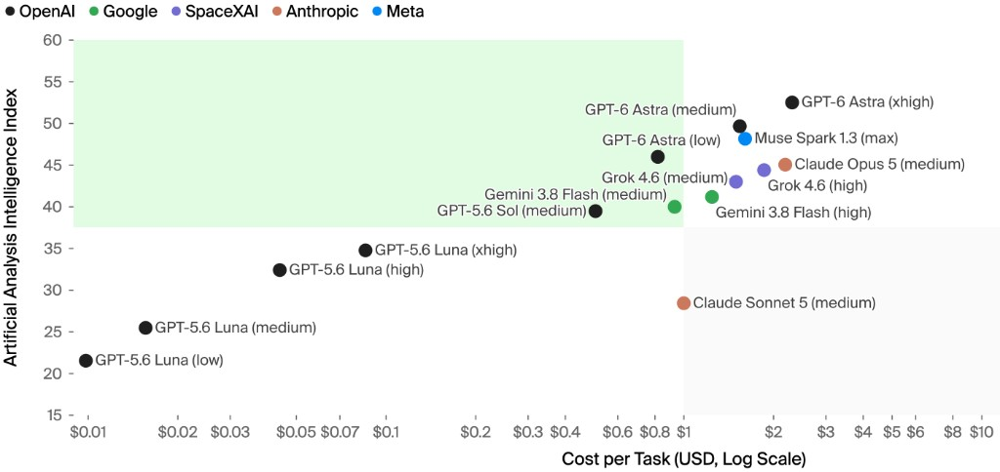

# coding-agent-config

Shared infrastructure for a **fleet of AI coding agents** across projects
and harnesses (Claude Code, Cursor, Antigravity, Codex, Copilot).

**Projects do not need their own AGENTS.md, skills, or agents.** Install
this repo (or its Agent Plugins slice), point the harness at it, and work
in a normal git checkout. Optional project files can still add science
rules later.

**This GPU/NFS host is optional.** Portable rules are
[`.agent-rules/AGENTS.md`](.agent-rules/AGENTS.md). Lab facts are
[`.agent-rules/host.md`](.agent-rules/host.md) — other machines skip that
file. Edit [`effort-models.json`](.agent-rules/effort-models.json) for
your own subscriptions; the checked-in map is the author's.

Deep layout and verification: [`.agent-rules/README.md`](.agent-rules/README.md).

PointStream's project agent files are snapshotted on unmerged branch
`archive/pointstream-agentic-2026-09-18` (restore only, not a second SoT).

## Platforms on the author's host

| Platform | Status on this host |
|---|---|
| [Claude Code](https://docs.anthropic.com/en/docs/claude-code) | live (rules, skills, agents, hooks) |
| [Cursor](https://cursor.com) | live (rules via project harness, skills via Claude path, agents, hooks) |
| [Google Antigravity](https://antigravity.google) | live (rules, skills, workflows); hooks pending verification |
| GitHub Copilot CLI | skills/agents farmed; hooks unverified |
| OpenAI Codex | live (CODEX_HOME on local disk; hook trust still pending-verification) |

Deep layout, hook dialects, verification claims, and living architecture
diagrams live in **[`.agent-rules/README.md`](.agent-rules/README.md)**. This
root file is the public overview.

## Which models to use (dated 2026-09-18)

Snapshot from [Artificial Analysis](https://artificialanalysis.ai) on
**2026-09-18** (simplified set). The axes are **API list price**. The
author pays **subscriptions**, so do not treat the Pareto line as the
ranking to follow. Edit `effort-models.json` for your bill. The chart is
stale the moment a newer one exists.



Interactive models are set once in each product UI. Subagent rungs live in
[`.agent-rules/effort-models.json`](.agent-rules/effort-models.json). The map
has **three rungs — junior, senior, escalation** — and seniority follows
model size: the senior wrangles context and judgment, a junior is a bounded
child with a runnable check, and the escalation rung is a fresh child after
`STUCK` or a failed check. The senior plans and dispatches; juniors
self-check; escalate only when stuck. Skill `session`. Family gate (hard) +
off-tier nudge (soft): `model_family` hooks.

## The problem

Run more than one coding agent (or the same agent across more than one
research repo) and the same failures show up quickly:

- Each agent forgets your codebase between sessions.
- Sibling projects solve the same problems independently — test-design
  workflows, results summarizers, paper editors — because no agent knows the
  others exist, and platform-native tools do not travel across vendors.
- Agents know average software-engineering practice, not *yours*.
- Prose rules alone are not enforcement: agents forget constraints that are
  already in context, burn tokens reinventing wait-loops, and happily spawn
  the wrong model family for a subagent.

You *can* get work done without shared infrastructure the same way you can
write software without classes or version control — if you waste enough
man-hours and context tokens. This repo exists to keep that waste down.

## What this repo provides

Everything below is authored once under [`.agent-rules/`](.agent-rules/) and
distributed by symlink, `@`-import, or a generated project file — never by
hand-copied drift.

### 1. Host-wide rules (`AGENTS.md` + per-agent harness)

- **[`AGENTS.md`](.agent-rules/AGENTS.md)** — tool-agnostic prose every agent
  should obey (git safety, research-test philosophy, long-job checkpointing,
  knowledge-loop habits). Lab GPU/NFS facts live in `host.md`, not here.
- **[`host.md`](.agent-rules/host.md)** — this machine only. Other clones skip it.
- **[`harness/<agent>.md`](.agent-rules/harness/)** — platform mechanics only
  (tool names, backgrounding, where that agent keeps config). Keeps Claude's
  `Monitor` / `run_in_background` advice from being handed to Cursor, where
  those tools do not exist.

Delivery uses three mechanisms because no single one reaches every consumer:

1. **Import** — `~/.claude/CLAUDE.md` and `~/.gemini/GEMINI.md` `@`-import the
   portable SoT (and `host.md` on this lab).
2. **Symlink** — `~/AGENTS.md`, `~/.gemini/AGENTS.md`, `$CODEX_HOME/AGENTS.md`
   point at the same bytes.
3. **Cursor User Rule** — Cursor does not walk up from a project folder.
   Point a User Rule at this clone; a project pointer file is optional.
   **Do not inline fleet rules into a project.** Cloud agents will not see
   `~`; accepted.

### 2. Global skills and subagents (skeleton + thin project wrappers)

Canonical tools under [`.agent-rules/skills/`](.agent-rules/skills/) and
[`.agent-rules/agents/`](.agent-rules/agents/), symlinked into each platform's
global folder:

| Kind | Name | Role |
|---|---|---|
| Skill | `session` | The senior's dispatch procedure: routing table, dispatch and report contracts, escalation ladder |
| Skill | `literature-review` | Read a field and come back with what is known and what is open |
| Skill | `figure-first` | Decide what a figure must show before any number is pulled |
| Skill | `implementation-plan` | Turn a goal into bounded, checkable pieces |
| Skill | `paper-outline` | Lay out the manuscript's sections, claims, and holes |
| Skill | `escalate` | Hand the problem to the human when two rungs are spent |
| Skill | `test-design` | Propose behaviour / misuse / deliberately-untested cases before writing tests |
| Skill | `results-report` | Summarize or compare experiment runs under a project's results dir |
| Skill | `verify-measurement` | Calibrate and null-control a number before reporting it |
| Skill | `paper-structure` | Check the manuscript's page, section, and float budget |
| Skill | `update-paper` | Fold findings into the manuscript + research log |
| Skill | `reviewer-response` | Close a reviewer checklist item end-to-end |
| Skill | `handoff` | Self-contained handoff doc for another agent/platform with zero shared memory |
| Skill | `end-of-session` | Close-out: surface knowledge, optional handoff, commit on invoke, ask before push |
| Skill | `evaluate-candidates` | Apply / discard / defer the central knowledge queue |
| Agent | `implementer` | Bounded code, test, or doc edit with a runnable check |
| Agent | `paper-screener` | Screen papers against written criteria |
| Agent | `data-condenser` | Pull numbers from existing runs into the shape a figure needs |
| Agent | `paper-editor` | Fill one paper marker with text |
| Agent | `referee` | Adversarial read of a manuscript before submission |
| Agent | `gpu-job-runner` | Run a long GPU or CPU job and return a distilled summary |
| Agent | `stuck-escalation` | Fresh child after `STUCK` or a failed check |

### How the tools work together

The **senior** is the interactive session. It holds the goal, the context,
and the judgment, and it is the only thing that talks to you. Senior
procedures are **skills** — a skill is a page the senior reads and follows
itself.

A **junior** is an agent file: a fresh context, a lower effort rung, and a
turn cap. It cannot see the senior's conversation, so every dispatch carries
seven fields — goal, read first, allowed paths, check, budget, report,
stuck rule — and every report comes back under five headings: Result,
Changed, Check, Not verified, Assumptions.

The senior then **re-runs the child's check** instead of reading the child's
work. A `STUCK` or a failed check goes to a *fresh* child on the escalation
rung — never the same child with a bigger model — and if that one is stuck
too, the `escalate` skill takes the question to the human.

Code enforces what prose cannot: `scripts/verify_roles.py` checks the
contracts, the Claude `SubagentStop` hook checks the report headings,
`scripts/paper-markers-lint.py` checks the manuscript's markers, and
`maxTurns` in the agent file holds the budget.

To add a role: write an agent file copying the shape of `implementer`, add a
row to the routing table in the `session` skill, then run `verify_roles.py`.

Projects that need local metrics or paper paths keep a **thin wrapper**
(project-specific `description` + pointer at the global body). Edit the
generic procedure once; it updates everywhere the symlink farm reaches.

### 3. Shared hook policy (`guardlib`) + per-platform adapters

Hook *policy* is shared; hook *plumbing* cannot be — platforms disagree on
event names, payload shape, and denial contracts. Policy lives once in
[`scripts/guardlib/`](.agent-rules/scripts/guardlib/); thin adapters speak each
dialect:

| Guard | What it stops / advises |
|---|---|
| `wait_loop` | Hand-rolled `pgrep`/`sleep` poll loops that match themselves and hang forever |
| `destructive_rm` | Broad `rm -rf` of unrecoverable paths (per-project `.agent-guards.json`) |
| `long_run` | Advisory when a command looks like a multi-hour training entry point |
| `model_family` | Prefer omit/inherit so subagents stay on the platform's in-house models; soft effort-tier nudge via [`effort-models.json`](.agent-rules/effort-models.json) |

Cursor, Claude, and (adapters shipped) Antigravity each get their own wrapper.
Fail-open vs fail-closed is deliberate: advisory scripts are direct-executable;
denying guards run via `python3 <path>` so a missing file fails closed.

### 4. Crossed-axis knowledge loop

Platforms × projects are a **grid**, not a stack. Knowledge can surface on
either axis into [`.agent-rules/candidates/`](.agent-rules/candidates/):

- `open/project/` — other projects may want this
- `open/platform/` — other platforms may need this
- `pending-verification/` — live config / “works on X” claims owned by platform X
- `done/` — audit trail

`end-of-session` considers both axes; `evaluate-candidates` applies or discards
asynchronously from a session on this repo. Progressive context nudges
(Cursor / Claude hooks) suggest handoff before auto-compact — they never force
mid-task handoff.

### 5. Tiered rule delivery for large project `AGENTS.md` files

`AGENTS.md` stays the complete hand-edited source. Platforms that can defer
load do:

| Platform | Always-on | Deferred |
|---|---|---|
| Claude Code | `CLAUDE.md` → `@.claude/project-core.md` | `.claude/rules/*.md` via `paths:` |
| Copilot Chat | `.github/copilot-instructions.md` | `.github/instructions/*.instructions.md` via `applyTo:` |
| Cursor / Codex / Antigravity / Copilot cloud | full `AGENTS.md` | — (eager by design) |

Mark a section with `<!-- scope: src/**, tests/** -->` above its heading.
Eager platforms are byte-for-byte unaffected (HTML comments are inert).
Measured Claude startup shrinks on the order of hundreds of lines per project
(see the table in [`.agent-rules/README.md`](.agent-rules/README.md)).

### 6. Installer, sync, and living docs

```bash
python3 .agent-rules/scripts/install.py          # create/verify symlink farm + MCP upsert
python3 .agent-rules/scripts/install.py --check  # report only
python3 .agent-rules/scripts/sync_agent_rules.py # (vendored into each project) regenerate project rule files
python3 .agent-rules/scripts/render_architecture.py --check  # living mermaid diagrams stay fresh
```

`install.py` only links into agent directories that already exist, reports
conflicts instead of clobbering real files, and upserts shared MCP servers by
name without removing unrelated marketplace entries.

## Unusual shape of this repository

On the author's machine this git repo **is the home directory**, with an
allowlist [`.gitignore`](.gitignore): ignore everything, then un-ignore only
`.agent-rules/`, a few wrapper config files, and this README. That keeps
credentials and project checkouts out of git while still versioning the SoT
in place.

If you adapt the idea elsewhere, you do not need that layout — clone
`.agent-rules/` (or the whole repo) anywhere convenient, point `install.py`'s
`HOST`/`HOME` at your paths, and keep the same “edit once, symlink everywhere”
discipline.

## Who this is for

- Anyone running more than one coding agent, or one agent across more
  than one repo, including **other people on other machines**.
- A **single project with no agent files** — global skills and `AGENTS.md`
  are enough.
- This lab, which also loads `host.md` for NFS/GPU facts.

Cloud agents still will not see `~`; that is accepted. Do not inline host
or fleet rules into a project to "fix" that.

## Learn more / contribute feedback

- Full design notes, tables, and verification status:
  [`.agent-rules/README.md`](.agent-rules/README.md)
- Knowledge-queue schema: [`.agent-rules/candidates/README.md`](.agent-rules/candidates/README.md)
- Enforceable-rules register: [`.agent-rules/enforceable-rules.md`](.agent-rules/enforceable-rules.md)

Issues and alternate designs welcome — this is still early infrastructure for
what a fleet of coding agents actually needs.
